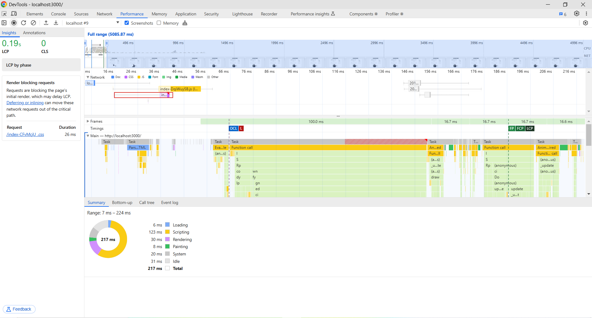

# Performance of Climate Data Visualization project app

## Introduction and Methodology

<!-- Briefly state how you gathered data about app performance, and in what environment 
(which browsers, what browser versions, what kind of device, OS,
width and height of viewport as reported in the console with `window.screen`) -->

<!-- Also report overall impact on whatdoesmysitecost results before and after all your changes -->

## Baseline Performance

<!-- Summarize initial results for each tool that you used. Did the tools
detect all the performance issues you see as a user? -->

## Areas to Improve
The main areas that needed improvement were:

Caching: Enabling caching to reduce the number of network requests and allow the browser to use locally stored assets and data.

Optimize re-renders: Reducing unnecessary re-renders when props remain unchanged.

Lazy-Loading Components: Deferring the loading of components that are not immediately visible.

Reducing Unused JavaScript: Optimizing imports and removing unused code from third-party libraries 

## Summary of Changes 

<!-- Briefly describe each change and the impact it had on performance (be specific). If there
was no performance improvement, explain why that might be the case -->

### Caching

Lead: Tommy Tran

Action: I configured the server to add cache control headers which allows the browser to cache static resource and API data for one year. The cache-control for index.html is no-cache to always revalidate with the server before using the cache version. Additionally, I added caching for API data on the server's memory with no TTL (Time to Live), as our historical emissions/temperature data do not change.

Impact: By setting a long cache duration for the browser and utilizing memory caching on the server, the page load times drastically improved. Subsequent visits loaded much faster, as the browser could reuse cached resources and the server didn't need to re-fetch the dataset.

Tool: I used devTools to check the response headers

Pre-Cache on AWS:

Pre-Cache on Render:

After-Cache on AWS:

After-Cache on Render:

---
### Unoptimized re-renders

Lead: Tommy Tran

Problem: Certain components (such as charts) were being re-rendered too frequently, even when their props hadn't changed. 
This happens every time the user selects a year or type anything in the country input field. 

Action: I added React.memo to wrap certain components (charts) that were being re-rendered too frequently. This change helped prevent re-renders of components unless their props changed. 

Impact: This significantly reduced unnecessary rendering during interactions with the user input on country/year selection. It also helps to optimize memory usage
In terms of performance, I didn't see any major improvement as the components themselves were not big.

Tool: I used the React Developer Tools' "Profiler" tab to check the re-rendering behavior

This issue could only be tested in development, as 'Profiler' is only available in development builds

Pre-optimization fix: Tested by changing the date selection input in our first view, and the result showed that all components in this parent component were being re-rendered

Post-optimization fix: Selecting a year or a country doesn't cause re-rendering on components.

---
### Compression

Lead: Haris Hussain

Problem: Static assets such as JavaScript and CSS were being served uncompressed, resulting in large payloads and slow loading times, particularly on slower networks.

Action: To address the issue, I enabled Gzip Compression on the server using the compression middleware in the Express framework. This middleware ensured that all static files, such as .js, .css, and .html, were transmitted in a compressed format. Additionally, I focused on compressing large JSON API responses to further optimize the data payload. To verify the effectiveness of this change, I used the Network tab in Chrome DevTools, specifically checking for the Content-Encoding: gzip header in the server's response.

Impact: The implementation of Gzip Compression  reduced the size of transmitted assets, resulting in an improvement in the app's load time. This change directly improved metrics  particularly for users accessing the app on slower networks. Users experienced faster content delivery, which enhanced the overall usability of the app.

- Pre-compression:
  - load : 429ms
  - .js 952kb 8ms
  - .css 4.1kb 3ms
  - 2012 1.5kb 24ms (API)
  - 2012 513B 19ms (API)
  - 2013 383B 104ms (API)
- Post-compression
  - load : 395ms
  - .js 303kb 30ms
  - .css 1.5kb 3ms
  - 2012 583B 3ms (API)
  - 2012 536B 2ms (API)
  - 2013 406B 2ms (API)
  
Tool Used: Lighthouse and Chrome DevTools to verify compressed asset delivery and measure the performance improvement.

---
### Lazy Loading

Lead: Haris Hussain

Problem: The MapChart component was included in the initial JavaScript bundle, leading to a significant portion of unused JavaScript on the page load. This impacted the app’s performance by increasing the initial load time and overall bundle size.

Action: To address this issue, I implemented lazy-loading for the MapChart component using React.lazy and Suspense. This ensured that the MapChart was only loaded when it entered the viewport. Additionally, the react-intersection-observer library was used to defer the loading of the map until it became 10% visible on the page.

Impact: This change reduced unused JavaScript flagged by Lighthouse from 88 KB to 44 KB, cutting it in half. The overall JavaScript bundle size decreased from 302 KB to 177 KB, reducing initial page load times. This optimization is especially beneficial for users on slower networks or devices, as it minimizes the resources required for the initial render.

#### Pre-Lazy Loading
LightHouse performance pre optimization

Bundlesize pre optimization

#### Post-Lazy Loading
LightHouse performance post optimization

Bundlesize post optimization

 
---
### Uncritical css

Lead: Aidan Holmes

Problem: the entirety of our css is loaded immediately, slowing down the inital load of of the website.

Action: i made a new uncriticalApp.css file and moved all css rules which where not relvent for the inital load to it, i then did the "media=print onload="this.media='all'"" trick when linking uncriticalApp.css so that it would only load afterwards 

Impact: the inital transfer size was reduced from 1.4 Kib, to 1.1 Kib. aproximately being 20ms faster then before according to the lighthouse report. however on other tabs it seemed somewhat slower for some reason, perhaps there simply isnt enough non-critical css to make it worthwhile? im not sure.

#### pre uncritical css

#### post uncritical css

## Conclusion

<!-- Summarize which changes had the greatest impact, note any surprising results and list 2-3 main 
things you learned from this experience. -->