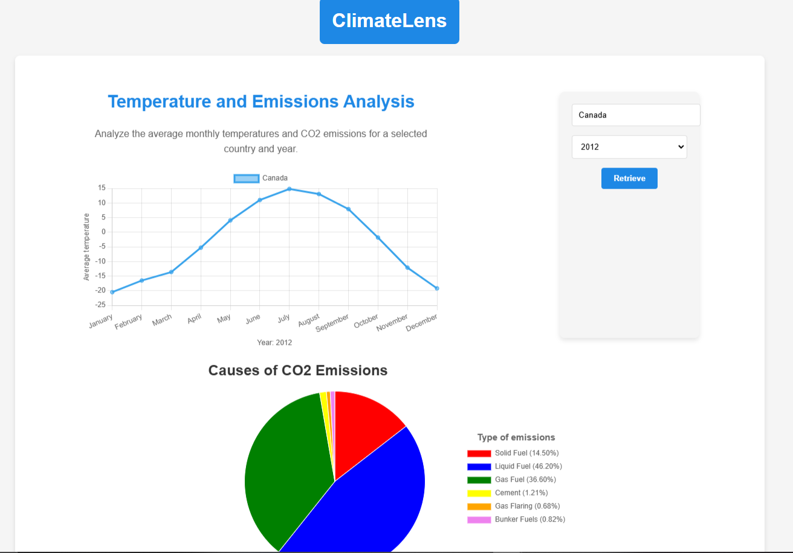

# Climate & CO2 Fluctuation 

## Project Description

This project is a Climate & CO2 Fluctuation Dashboard that provides an interactive visualization of climate and CO2 emissions data. The application allows users to explore temperature variations, CO2 emissions by country, and compare average temperatures across multiple countries over time. The dashboard is intended to raise awareness and provide insights into the environmental impacts of CO2 emissions.

## Goal

The goal of this project is to provide a user-friendly platform that enables users to:
- Visualize climate data trends over the years.
- Compare CO2 emissions data for different countries.
- Observe temperature fluctuations over a selected time range.
- Gain a deeper understanding of the relationship between CO2 emissions and temperature changes globally.

## Screenshot




## Setup Instructions

### Prerequisites

- Node.js 
- Git

### Steps

1. **Clone the repository**
   ```bash
   git clone https://gitlab.com/dawson-csy3-24-25/520/section1/teams/TeamF-13/520-project-hussain-tran-holmes.git
   cd 520-project-hussain-tran-holmes
   ```

2. **Install server dependencies**
   ```bash
   cd server
   npm install
   ```

3. **Install client dependencies**
   ```bash
   cd ../client
   npm install
   ```

4. **Setup environment variables**
   - Create `.env` files in the `server` directory containing MongoDB AtlasUrl.

5. **Build and start the application**

   *To build the client and start the server:*
   ```bash
   cd ..
   npm run build   # Builds the client
   npm run start   # Starts the server
   ```

6. **View the application**
   Open [http://localhost:3000](http://localhost:3000) in your browser to view the dashboard.

## Render
Our app is also deployed on Render at https://project-hussain-tran-holmes.onrender.com/. 

It is set to automatically re-deploy whenever the specified branch (in this case, the 'staging' branch) is updated.

If you want to deploy the app as a new deployment or for another branch, follow these steps:

1.  Log in to Render
2. In the Dashboard, select Web Server
3. **Configure deployment settings**
   
   - **Git provider**: Connect to Gitlab and choose this repository
   - **Name**: Enter a name for your web service
   - **Language**: Select Node
   - **Branch**: Choose the branch to deploy
   - **Root directory**: Set to . (root of the project)
   - **Build command**: 
      ```
      cd client && npm install && npm run build && cd ../server && npm install --production
   - **Start command**:
      ```
      NODE_ENV=production cd server && node bin/www
   - **Instance type**: Choose the free one
   - **Environment variable**: Add necessary environment variable (Your ATLAS_URI)
4. **Update MongoDB ATLAS**
   
   - Click **connect** and copy the outbound IP addresses
   - In MongoDB Atlas, go to **Security** -> **Network Access** and add these IP addresses to the IP access list.

## Attributions


### Data Sources
- **Climate Data**: Sourced from [Temperature Data](https://www.kaggle.com/datasets/berkeleyearth/climate-change-earth-surface-temperature-data/data?select=GlobalLandTemperaturesByCountry.csv), including historical temperature records data by country and year.
- **Emission Data** : Sourced from [Emission Data](https://github.com/datasets/co2-fossil-by-nation/blob/main/data/fossil-fuel-co2-emissions-by-nation.csv), includes CO2 emissions data by country and year.
- **Country Codes**: [country-list](https://www.npmjs.com/package/country-list) library for standardizing country codes.

### Libraries Used
- **Frontend**
  - [React](https://reactjs.org/) - Frontend library for building user interfaces.
  - [amCharts](https://www.amcharts.com/) - Used for creating interactive map and chart visualizations.
  - [Chart.js](https://www.chartjs.org/) - Used for generating bar and line charts for climate data.
  - [Vite](https://vitejs.dev/) - Development tool for fast builds and optimized bundles.

- **Backend**
  - [Express](https://expressjs.com/) - Web framework for Node.js.
  - [Node.js](https://nodejs.org/) - JavaScript runtime for the backend.
  - [dotenv](https://www.npmjs.com/package/dotenv) - Used for loading environment variables.
  - [MongoDB](https://www.mongodb.com/) - Database for App

- **Testing and CI/CD**
  - [bundlesize2](https://www.npmjs.com/package/bundlesize2) - Monitors the size of client-side bundles.
  - GitLab CI - For continuous integration and deployment.