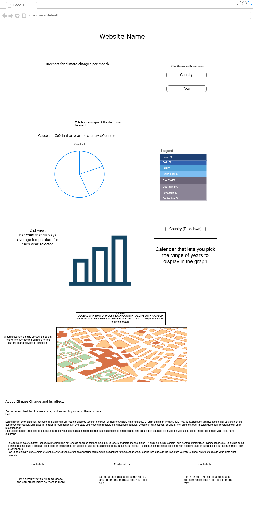
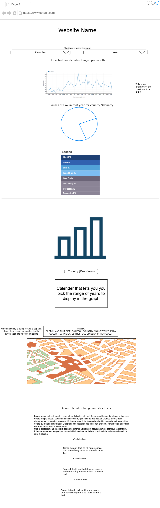

# Climate & CO2 Fluctuation

## Data
- **Links to Data:**  
  - [CO2 Emissions by Nation (GitHub)](https://github.com/datasets/co2-fossil-by-nation/blob/main/data/fossil-fuel-co2-emissions-by-nation.csv)  
  - [Climate Change Data (Kaggle)](https://www.kaggle.com/datasets/berkeleyearth/climate-change-earth-surface-temperature-data/data?select=GlobalLandTemperaturesByCountry.csv)  

**Summary:**  
This project will use two datasets to analyze the relationship between CO2 emissions from fossil fuels and surface temperature changes across different countries over time. The CO2 dataset provides annual emission values by nation, while the temperature dataset offers monthly surface temperature data by country. We will create interactive visualizations to explore the impact of fossil fuel emissions on global warming.

---

## API
1. **GET /api/temp/:country?/:year?**  
   - **Description:** Returns temperature data. If `country` or `year` is not provided, it returns all available data.  
   - **Parameters:**  
     - `:country` (optional): Filter data by country (case-insensitive).  
     - `:year` (optional): Filter data by year.  

2. **GET /api/emission/:country?/:year?**  
   - **Description:** Returns CO2 emission data. If `country` or `year` is not provided, it returns all available data.  
   - **Parameters:**  
     - `:country` (optional): Filter data by country (case-insensitive).  
     - `:year` (optional): Filter data by year.  

3. **GET /api/random**  
   - **Description:** Returns data for a random country and year.  
   - **Response:**  
     - A random country and a random year with both temperature and emission data.

---

## Visualizations
- **Description:**  
  - A **line chart** will display temperature trends over time.  
  - A **pie chart** will show the causes of CO2 emissions for a selected country and year.  
  - **Legends** will categorize the different sources of emissions.  

- **User Story:**  
  Users will be able to visualize both climate change and emissions data, with the ability to filter by country and year. The goal is to help users explore trends in global warming and understand the contributions of various countries to CO2 emissions.

---

## Views

On Desktop the fold should be below the "about climate change and its effects" text, making its existance obvious to the viewer.

On Mobile the fold should be right below the graph, just above the legend.

---

## Functionality
- Users will be able to:
  - Select a year and up to two countries to filter the data, via three dropdown boxes or checkboxes. When a country is selected,
  the data for that country will appear on the line chart. Unselecting it will remove that country's data from the chart.
  By selecting two countries, users can compare the data of the two countries simultaneously on the same line chart.
  - Select specific countries and years to filter data by using the dropdown or checkboxes list. 
  - View temperature trends and emission sources using interactive charts.
  - Hover over charts to see specific data points.
---

## Features and Priorities
- **Core Features:**  
  - Interactive line chart for temperature data.  
  - Pie chart showing CO2 emission breakdown based on the selected countries (max 2)
  - Filter functionality by country and year.
  
- **Potential Cuts (if needed):**  
  - Advanced filtering for specific fossil fuel categories.  
  - Animations or transitions.
  - Allowing more then 2 Countries to be selected at once
---

## Dependencies
- We plan to use React-Plotly as the client-side visualization library as it offers more customization options compared to Chart.js. As of right now, we are not 100% confirmed to be using it. We might consider switching to Chart.js if we find that implementing Plotly becomes too complicated. We aim to choose the library that best fits our project's needs as we progress.

---

This project will explore the relationship between fossil fuel CO2 emissions and climate change. Through interactive visualizations, users will gain insights into the impact of emissions on global temperatures and explore how different countries contribute to climate change.
